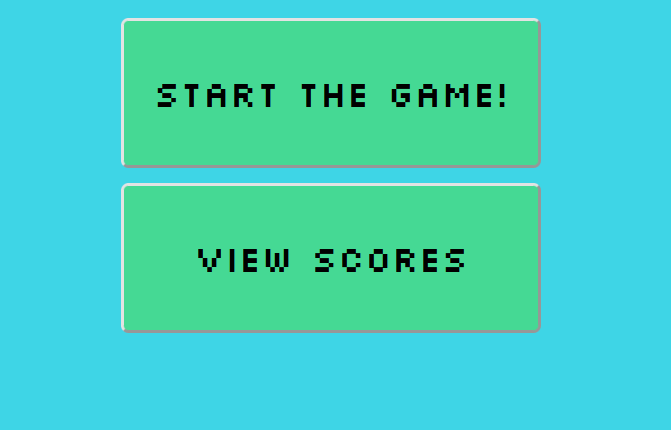
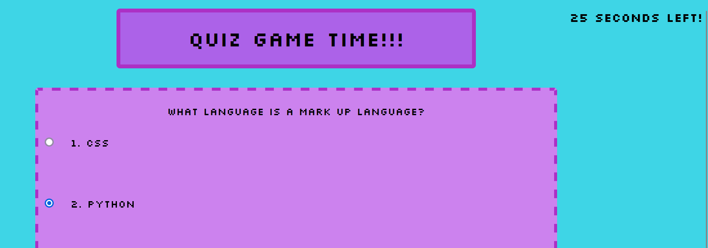
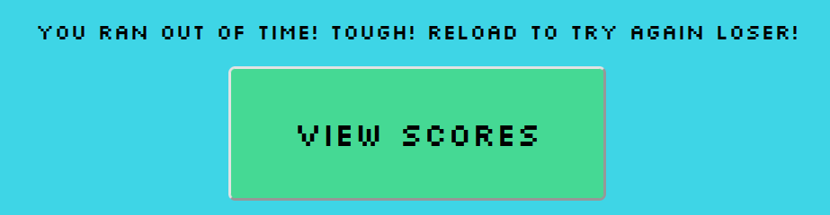
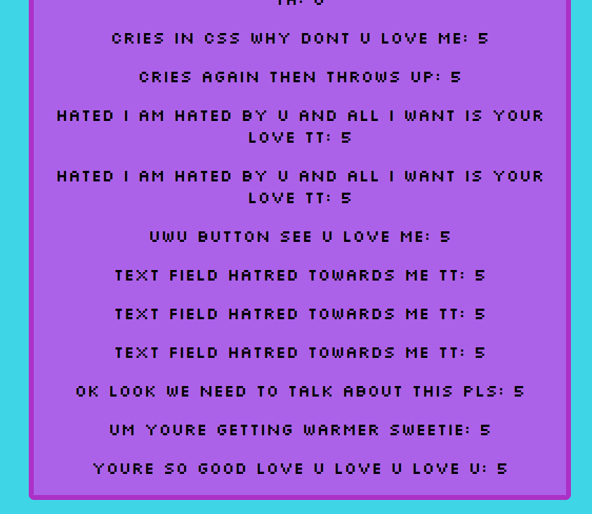

# My Quiz Website!!!
## Creating a functional quiz that utilizes localStorage and the DOM
### Description
This quiz website features a retro styling along with only five very easy questions so don't get any of them wrong! Because its so easy wrong answers will result and time being taken off and the possibility of your scores going into negative numbers. If you run out of time you will lose the ability to enter a score for that try so reload the page or click through the buttons! 
### Installation
Github offers a few different methods of how to download a project to your local computer. Feel free to peruse the files here on Github or clone the repository to your local machine! You can also download the code as a .zip file. If you are just looking to test your coding knowledge there will be a link to the deployed Github pages page below!
### Visuals
The landing page

First question sneak peak!

Running out of time!

Fighting with the CSS to center the textbox

### Usage
This quiz tests very basic coding knowledge so its best use-case if having someone not familiar with coding try their hand at it :D
### Features
Using a combination of JavaScript, CSS and HTML and a lot of convoluted code, this web application features a quiz with five wuestions each with four options, a timer that when runs out stops the quiz does not allow you to input a score. When the quiz is completed successfully the user will be prompted to enter their initials and submit their score which they can then view by clicking on the 'View Scores' button. 
### Project Status
This project is currently complete and can be found here: